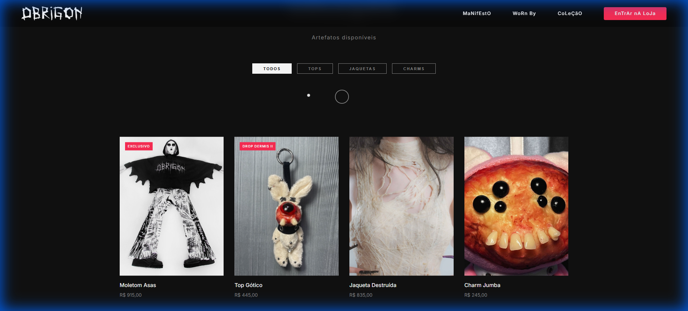

# 🖤 OBRIGON — Landing Page

Landing page imersiva para a marca de moda gótica de luxo **Obrigon**.



---

## 📁 Estrutura do Projeto

```
obrigon/
├── v2/                 # Versão Experimental (Unheimlich)
├── index.html          # Página principal (v1)
├── style.css           # Estilos dark luxury (v1)
├── main.js             # Animações GSAP + interações (v1)
├── assets/             # Logo e assets
│   └── logo.png
├── image/              # Imagens dos produtos
│   └── *.jpg
└── docs/               # Documentação
    ├── brainstorm.md       # Brainstorm e conceitos
    ├── walkthrough.md      # Implementação e testes
    └── screenshots/        # Gravações e prints
```

---

## 🛠️ Stack Tecnológica

| Tecnologia | Versão | Uso |
|------------|--------|-----|
| **HTML/CSS/JS** | Vanilla | Base do projeto |
| **GSAP** | 3.12.5 | Animações e ScrollTrigger |
| **Lenis** | 1.1.18 | Smooth scroll |
| **Google Fonts** | Bebas Neue + Inter | Tipografia |

---

## 🚀 Como Rodar

```bash
# Instalar servidor local
npx serve -p 3030

# Acessar
http://localhost:3030
```

---

## ✨ Funcionalidades

- ✅ Loader animado com logo
- ✅ Hero section com reveal GSAP
- ✅ Manifesto com parallax
- ✅ Marquee infinito de artistas
- ✅ Filtro de categorias de produtos
- ✅ Cursor customizado
- ✅ Smooth scroll (Lenis)
- ✅ Scroll-triggered animations

---

## 📋 Documentação

- **[V2 Experimental](v2/README.md)** — Documentação da versão conceito "Unheimlich"
- **[Brainstorm](docs/brainstorm.md)** — Conceitos, referências e direções criativas
- **[Walkthrough](docs/walkthrough.md)** — Implementação e testes realizados
- **[Screenshots](docs/screenshots/)** — Gravações do site funcionando

---

## 🎨 Estética

**Conceito:** "Rituais + Underground Luxo"

- Fundo escuro (#0a0a0a)
- Accent vermelho (#ff2d55)
- Tipografia display (Bebas Neue)
- Animações cinematográficas
- Grain texture sutil

---

## 📦 Próximos Passos

- [ ] Adicionar mais imagens de produtos
- [ ] Menu mobile responsivo
- [ ] Deploy no Netlify/Vercel
- [ ] Integração com Shopify API
- [ ] Seção "Worn By" com fotos de artistas

---

## 🖤 Créditos

**Marca:** [Obrigon](https://obrigon.com)  
**Desenvolvido como surpresa** 🎁

---

*"Cada peça é um ritual."*
