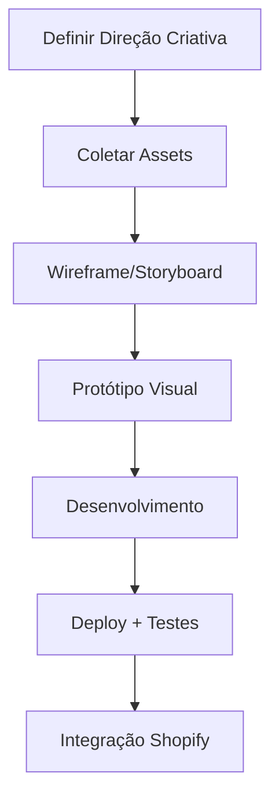

# 🖤 OBRIGON — Brainstorm & Creative Direction

> **Marca:** Obrigon — Moda gótica de luxo, artesanal, usada por Madonna, Luísa Sonza, Matuê
> **Atual:** E-commerce Shopify funcional mas sem "wow factor"
> **Objetivo:** Criar uma experiência digital que traduza a essência dark/luxo/artística da marca

---

## 📸 Estado Atual do Site

````carousel

<!-- slide -->

<!-- slide -->

<!-- slide -->

<!-- slide -->

````

### O que funciona bem:
- ✅ Tipografia custom interessante (logo OBRIGON)
- ✅ Fotografia de qualidade dos produtos
- ✅ Grid de produtos clean
- ✅ Charms únicos e bizarros que são a identidade da marca

### O que falta:
- ❌ Zero animações/transições
- ❌ Sem storytelling/narrativa
- ❌ Layout genérico de e-commerce 
- ❌ Não transmite o luxo/exclusividade
- ❌ Falta a "aura" gótica/artística

---

## 🔮 Referências Premium Pesquisadas

### 1. **Ousmane Dembélé — Ballon d'Or** (Awwwards SOTD)
| Aspecto | O que fazem |
|---------|-------------|
| **Tech** | GSAP + Three.js + Webflow + WebGL |
| **Conceito** | "From the streets to legend" — storytelling imersivo |
| **Animações** | Partículas de bola, jerseys animados, 404 interativo |
| **Score** | 7.43/10 Awwwards |

> 💡 **Aplicável à Obrigon:** A jornada "de artesão a vestir celebridades"

---

### 2. **Cartier — Luxury Digital Experience**
| Aspecto | O que fazem |
|---------|-------------|
| **Tech** | Headless CMS, WebGL, AR |
| **Design** | Minimalista, fundo branco, foco no produto |
| **Animações** | 3D products, scroll-based reveals, micro-animations |
| **Reconhecimento** | Múltiplos Awwwards SOTD |

> 💡 **Aplicável à Obrigon:** Animações 3D de produtos, reveals cinematográficas

---

### 3. **VOODOOMANIACS (Gothic Steampunk)**
- Awwwards Nominee
- E-commerce gótico alemão
- Referência direta de estética dark

---

### 4. **Marcas de Latex (Atsuko Kudo, Libidex)**
- Apresentação couture
- Fotografia high-gloss
- Foco no material e forma
- Layout editorial

---

## 🎨 Conceitos Criativos para Obrigon

### Direção 1: **"RITUAIS"**
```
A moda como ritual. Cada peça é um artefato. 
O site como um altar digital.
```
- **Visual:** Velas, fumaça, símbolos
- **Scroll:** Revelar produtos como se estivesse desvendando mistérios
- **Som:** Opcional - ambient dark/industrial

---

### Direção 2: **"GALERIA/MUSEU"**
```
Cada peça é uma obra de arte.
O site como curadoria de arte vestível.
```
- **Visual:** Fundo escuro, iluminação spotlight nos produtos
- **Transições:** Como caminhar em uma galeria
- **Referência:** House of Spoils, sites de museus

---

### Direção 3: **"METAMORFOSE"**
```
Transformação. Latex, couro, skin.
A roupa como segunda pele.
```
- **Visual:** Texturas orgânicas, morphing, fluidos
- **Animações:** Distorções suaves, transições fluidas
- **Conceito:** A peça "nascendo" do material

---

### Direção 4: **"UNDERGROUND LUXO"**
```
O submundo elevado ao luxo.
Raves, catacumbas, alta costura.
```
- **Visual:** Neon no escuro, glitches sutis, contraste extremo
- **Vibe:** Blade Runner meets haute couture
- **Referência:** Sites de clubes/festivais premium

---

## 🛠️ Stack Técnica (Vibe Coder Friendly)

### ✅ RECOMENDADA: Showcase/Landing Page

| Componente | Tecnologia | Por quê? |
|------------|------------|----------|
| **Base** | HTML + CSS + Vanilla JS | Sem framework, controle total |
| **Animações** | GSAP + ScrollTrigger | Padrão da indústria, docs excelentes |
| **Scroll Suave** | Lenis.js | Leve, elegante |
| **Deploy** | Netlify ou Vercel | Git push = site no ar |
| **Imagens** | Otimizadas WebP | Performance |

> [!IMPORTANT]
> Esta stack cria uma **Landing Page / Showcase** separada da Shopify.
> O e-commerce continua na Shopify (carrinho, pagamento, etc).
> A landing page é a "experiência" — o wrapper premium.

---

### ⚠️ ALTERNATIVAS (Mais complexas)

| Opção | Prós | Contras |
|-------|------|---------|
| **Webflow** | Visual builder, animações nativas | Custo mensal, curva de aprendizado |
| **Framer** | Design-first, animações fáceis | Menos controle, custo |
| **Next.js** | Framework moderno | Overkill para landing, mais complexo |

---

## 🎬 O que podemos criar

### Fase 1: Landing Page Cinematográfica
1. **Hero** com animação de entrada impactante
2. **Parallax scroll** com produtos
3. **Revelar de produtos** com efeitos de luz
4. **Seção "Worn By"** — celebridades que usam
5. **CTA para Shopify** — redireciona para loja

### Fase 2: Páginas Internas (opcional)
- Página "Sobre" com história da marca
- Lookbook interativo
- Galeria de campanhas

### Fase 3: Micro-interações na Shopify
- CSS custom injetado
- Scripts de animação leves
- Hover effects nos produtos

---

## ❓ Perguntas para Você

1. **Qual direção criativa te atrai mais?**
   - Rituais / Galeria / Metamorfose / Underground Luxo?

2. **Qual o escopo inicial?**
   - Landing page showcase separada?
   - Ou melhorias direto na Shopify?

3. **Tem mais materiais?**
   - Fotos de campanhas?
   - Vídeos de desfiles/bastidores?
   - Assets do Instagram?

4. **Budget de tempo?**
   - Projeto rápido (1-2 semanas)?
   - Ou mais elaborado (1+ mês)?

5. **Domínio separado?**
   - obrigon.com (atual Shopify)
   - experience.obrigon.com (nova landing)?

---

## 🔗 Próximos Passos Sugeridos



---

> *"Não é sobre vender roupa. É sobre criar um culto."*
